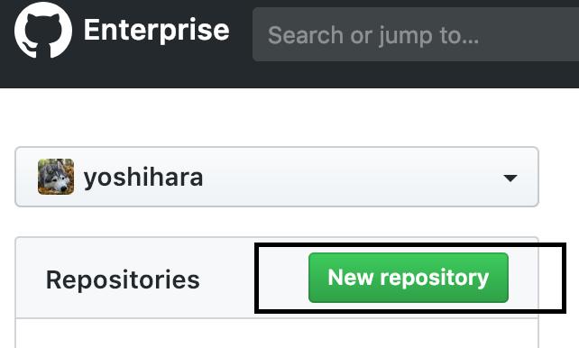

# Git について

## 目次
<!-- TOC -->

- [Git について](#)
  - [目次](#目次)
  - [はじめに](#はじめに)
    - [Git とは](#git-とは)
    - [GitHub とは](#github-とは)
    - [GitHub Enterprise とは](#github-enterprise-とは)
    - [GitHub Flow とは](#github-flow-とは)
      - [前提](#前提)
      - [開発の流れ（master ブランチへマージする場合）](#開発の流れmaster-ブランチへマージする場合)
    - [用語解説](#用語解説)
      - [リポジトリ](#リポジトリ)
      - [クローン](#クローン)
      - [ブランチ](#ブランチ)
      - [コンフリクト](#コンフリクト)
      - [プルリクエスト](#プルリクエスト)
  - [Git の導入](#git-の導入)
    - [CUI or GUI](#cui-or-gui)
    - [（1） Git のインストール](#1-git-のインストール)
      - [Windows](#windows)
      - [Mac](#mac)
    - [（2）基本情報の設定](#2基本情報の設定)
    - [（3） Personal access token を取得する](#3-personal-access-token-を取得する)
    - [【Mac のみ】Git 環境設定](#mac-のみgit-環境設定)
      - [.DS_Store を Git の監視対象から除外する](#ds_store-を-git-の監視対象から除外する)
      - [Git コマンド補完の有効化やカレントブランチ名表示に対応する](#git-コマンド補完の有効化やカレントブランチ名表示に対応する)
  - [Git コマンドの基本操作](#git-コマンドの基本操作)
    - [クローン](#クローン-1)
      - [リポジトリをクローンする場合](#リポジトリをクローンする場合)
    - [ブランチ](#ブランチ-1)
      - [ブランチの作成](#ブランチの作成)
        - [master ブランチを基にした my-branch を作成する場合](#master-ブランチを基にした-my-branch-を作成する場合)
      - [ブランチの削除](#ブランチの削除)
      - [ブランチ間の移動](#ブランチ間の移動)
    - [ステージング](#ステージング)
      - [ステージングへファイルをアップする](#ステージングへファイルをアップする)
    - [コミット](#コミット)
      - [直前のコミットメッセージを修正する](#直前のコミットメッセージを修正する)
    - [プッシュ](#プッシュ)
    - [タグ](#タグ)
      - [タグの種類](#タグの種類)
      - [タグのプッシュ](#タグのプッシュ)
    - [リセット](#リセット)
    - [ログ](#ログ)
    - [スタッシュ](#スタッシュ)
    - [リバート](#リバート)
  - [コンフリクトを解決する](#コンフリクトを解決する)
    - [登場するブランチ](#登場するブランチ)
    - [ブランチごとのファイルの内容](#ブランチごとのファイルの内容)
    - [マージ処理の流れ](#マージ処理の流れ)
  - [エイリアスを登録する](#エイリアスを登録する)
    - [比較](#比較)
  - [リポジトリ作成と設定](#リポジトリ作成と設定)
    - [GHE からリポジトリを作成する](#ghe-からリポジトリを作成する)
    - [リポジトリの各種設定を行う](#リポジトリの各種設定を行う)
      - [リポジトリの作業者を選択する](#リポジトリの作業者を選択する)
        - [権限について](#権限について)
      - [ブランチを保護する](#ブランチを保護する)

<!-- /TOC -->

## はじめに

ここでは Git について解説します。<br>

Git についてより詳細に知る場合は、主に下記を参照してください。
- [Git - Reference](https://git-scm.com/docs) 
- [Git - Book](https://git-scm.com/book/ja/v2)

### Git とは
 Git とは、ファイルの変更履歴を記録・追跡するための分散型バージョン管理システムです。<br>Git を使用すると、同一ファイルを複数人で編集したり、ファイルを任意のバージョンに戻すことが容易になります。

### GitHub とは

GitHub とは Git を用いたWebサービスです。ファイルの記録・追跡のほか、様々なプロジェクトのリポジトリをホスティングしてくれます。<br>公開されているリポジトリには不特定多数のユーザがアクセスできます。リポジトリに対して「クローン」、「フォーク」、「プルリクエスト」などの操作を行うことができます。

### GitHub Enterprise とは
GitHub Enterprise とは、社内に GitHub を構築できる企業向けに特化したサービスです。<br>以降 GHE と表記します。

### GitHub Flow とは
簡単にまとめると以下のとおりです。

#### 前提
- master ブランチは常にデプロイ可能です。（いつでも納品できる状態）

#### 開発の流れ（master ブランチへマージする場合）
1. master ブランチから新たにブランチを作成します（作業ブランチとする）。<br>ブランチ名は何の作業なのかが分かる意味のある名称にします。（例：`add_main-visual`）
2. 空コミットをしたうえで、プルリクエストを行います。（基となったブランチと差分がない場合プルリクエストはできません）
   - 空コミットは、`$ git commit --allow-empty -m "empty commit"`で行うことができます。
   - ~~プルリクエストのタイトルには、作業中であれば`[WIP]`(Work In Progress)と付けます。
3. 作業が完了した場合、プルリクエストのタイトルから`[WIP]`を取ります。レビューを頼む場合、レビュアーにメンバーを指定してレビューをしてもらいます。
4. レビューで承認されたら master ブランチにマージします。

より詳しい図や解説は下記を参照してください。

- [Understanding the GitHub flow](https://guides.github.com/introduction/flow/)
- [GitHub Flow 図解](https://qiita.com/tbpgr/items/4ff76ef35c4ff0ec8314)

### 用語解説

#### リポジトリ
プロジェクトのデータを一元管理する貯蔵庫の役割をします。<br>基本的に1プロジェクトにつき1リポジトリを作成します。

#### クローン
リポジトリをローカルなどの任意の場所にコピーすることができます。

#### ブランチ
ブランチは英語で枝を意味します。<br>リポジトリのファイルに変更を加える際、コンフリクトやバグの混入を防ぐため、基本的に新たに作成したブランチで作業します。

#### コンフリクト
変更をマージする際に Git がどちらの変更を取り込むべか自動的に解決できなかった場合、該当箇所はコンフリクト状態となり手動で解決する必要があります。

#### プルリクエスト
作業ブランチを他ブランチへマージするにはプルリクエストを行います。<br>プルリクエストを行うと、マージ先のブランチとの差分の確認やコメント・レビューを受けることができます。

---

## Git の導入

### CUI or GUI
Git は（Character User Interface）と GUI（Graphical User Interface）のどちらでも使用可能です。<br>CUI は不慣れな人が多いかもしれませんが、最初は CUI を用いて Git 
を使ってみることをおすすめします。<br>ここでは、CUI で Git を導入する手順を解説します。

### （1） Git のインストール

#### Windows
[インストーラー](https://git-for-windows.github.io/)

#### Mac
Mavericks（10.9）以降であれば標準でインストールされていますが、Homebrew というパッケージマネージャーを使用して最新の Git をインストールしなおしましょう。

1. **Homebrew をインストールする**<br>ターミナルを開いて下記コマンドを実行します。
```Git Bash
$ /usr/bin/ruby -e "$(curl -fsSL https://raw.githubusercontent.com/Homebrew/install/master/install)"
```

2. **Homebrew で Git をインストールする**<br>ターミナルで下記コマンドを実行します。
```Git Bash
$ brew install git
```

Homebrew についての詳しい解説は下記を参照してください。
- [Homebrew](https://git-scm.com/download/mac)
- [homebrewとは何者か。仕組みについて調べてみた](https://qiita.com/omega999/items/6f65217b81ad3fffe7e6)

### （2）基本情報の設定
1. Windows であれば「Git Bash」、Mac であれば「ターミナル」を開きます。
2. 氏名、メールアドレスを登録するため、下記コマンドをそれぞれ自分の氏名、メールアドレスに置き換えて実行します。

```Git Bash
$ git config --global user.name "Your Name"
$ git config --global user.email "your-address@test.co.jp"
```

3. 入力情報が正しいか確認します。

```Git Bash
$ git config --list
credential.helper=osxkeychain
user.name=Your Name
user.email=your-address@test.co.jp
```

4. 改行コード変換設定を変更します。<br>`autocrlf` の設定が適切でないと、コードのすべてが差分として検出され、コードレビューが困難になります。必ず適切な値を設定してください。
   - Windows の場合
    ```
    $ git config --global core.autocrlf true
    ```

   - Mac の場合
    ```
    $ git config --global core.autocrlf input
    $ git config --global core.safecrlf true
    ```

5. 設定が変更されているか確認します。

Mac の場合
```
$ git config --list
core.autocrlf=input
core.safecrlf=true
```

### （3） Personal access token を取得する
GHE のリポジトリへの操作ができるように、Personal access token を取得します。

1. GHE トップのヘッダーメニューから「Settings」をクリックします。


2. 「Developer settings」 > 「Personal access tokens」にある「Generate new token」をクリックします。


3. 「New personal access token」で各種設定を行います。

   - **Token description**<br>トークンの説明を記述します。（使用する機器名など）
   - **Select scopes**<br>「repo」にチェックを入れ、ページ下部の「Generate token」をクリックします。

  より詳しいスコープの解説は下記を参照してください。
  - [Understanding scopes for OAuth Apps](https://developer.github.com/enterprise/2.16/apps/building-oauth-apps/understanding-scopes-for-oauth-apps/)

1. 生成されたアクセストークンは一度しか表示されないので、Google Drive などに保存しておきます。<br>万が一アクセストークンを忘れても、各トークンの詳細ページにある「Regenerate token」で再発行できます。


5. リポジトリをクローンします。<br>ユーザー名とパスワードを聞かれるので、それぞれ以下の値を入力してください。
  - **Username:**<br>`git config user.name` の値です。
  - **Password:**<br>生成したアクセストークンの値です。

  成功すると、リポジトリのクローンが完了し、リモートリポジトリへのプッシュなどが可能になります。
   ```Git Bash
   $ git clone https://github.xxx.co.jp/xxx.git
   Cloning into 'xxx'...
   Username for 'xxx'
   Password for 'xxx: 
   remote: Enumerating objects: 18, done.
   remote: Counting objects: 100% (18/18), done.
   remote: Compressing objects: 100% (14/14), done.
   remote: Total 8514 (delta 6), reused 10 (delta 4), pack-reused 8496
   Receiving objects: 100% (8514/8514), 262.87 MiB | 8.24 MiB/s, done.
   Resolving deltas: 100% (5170/5170), done.
   Checking out files: 100% (786/786), done.
   ```
---

### 【Mac のみ】Git 環境設定

#### .DS_Store を Git の監視対象から除外する
Mac のみが生成するファイル `.DS_Store` を Git の監視対象から除外します。
```Git Bash
$ cd ~/
$ vi ~/.gitignoreglobal /* .gitignoreglobal ファイル内に .DS_Store を記載してください。 */
$ git config –global core.excludesfile ~/.gitignore_global /* Git に .gitignoreglobal を設定 */
```

#### Git コマンド補完の有効化やカレントブランチ名表示に対応する
Mac にはデフォルトで Git がインストールされていますが、`Homebrew` でインストールし直したほうがよさそうです。

- [Mac のGitで補完を効かせたりブランチ名を表示する設定(Homebrewでgitをインストールした場合)](https://qiita.com/koyopro/items/3fce94537df2be6247a3)

---

## Git コマンドの基本操作
よく使用する Git コマンドを紹介します。

### クローン

#### リポジトリをクローンする場合

1. クローンしたいリポジトリへ移動し、「Clone or Download」をクリックします。
2. リポジトリの URL をコピーします。


3. クローンしたいフォルダへ移動します。
```Git Bash
$ cd ~/Sites/
```

4. クローンコマンドを `git clone リポジトリURL` を実行します。
```Git Bash
$ git clone https://github.xxx.co.jp/xxx.git
```

5. ユーザー名、パスワードを聞かれた場合
    - **ユーザー名**
    `git config user.name` の値です。
    - **パスワード**
    GHE に登録してある SSH Key です。

### ブランチ
ブランチの作成・削除や移動方法などについて解説します。

#### ブランチの作成
##### master ブランチを基にした my-branch を作成する場合
1. 新たにブランチを作成する前に、新規ブランチの基となるブランチに移動し最新状態に更新します。<br>
`fetch` から `merge` の実行は、`pull` コマンドで置き換えることができます。<br>

```Git Bash
$ git checkout master  　　 /* master ブランチへ移動 */
$ git fetch            　　 /* ローカルリポジトリを最新の状態に更新 */
$ git merge origin/master  /* ローカルリポジトリの情報で master ブランチを更新 */
```

2. ブランチを作成方法は2種類あります。
    - その場で新規ブランチを作成する
    ```Git Bash
    $ git branch my-branch
    ```
    - その場で新規ブランチを作成し、作成したブランチに移動する
    ```Git Bash
    $ git checkout -b my-branch
    ```

#### ブランチの削除
`my-branch` を削除する場合。
```Git Bash
$ git branch -D my-branch
```

#### ブランチ間の移動
`my-branch` へ移動する場合。
```Git Bash
$ git checkout my-branch
```

より詳しい解説は下記を参照してください。
- [Git - git-branch Documentation](https://git-scm.com/docs/git-branch)


### ステージング
Git にはステージングエリアがあります。ステージングエリアには、Git リポジトリにコミットする対象ファイルを置きます。

#### ステージングへファイルをアップする
`add` コマンドを使用します。
```Git Bash
$ git add . 　　   /* 変更されたすべてのファイルをステージングへアップする */
$ git add *.html  /* ファイル形式を指定して、拡張子が '.html' のファイルのみステージングへアップする */
$ git add ./src/inedx.html  /* ファイルを指定して './src/index.html' ファイルのみ、ステージングへアップする */
```

### コミット
ステージングエリアにあるファイルをコミットします。<br>
コミットメッセージは修正内容の概要を記述します。
```Git Bash
$ git commit -m "画像差し替え"
```

#### 直前のコミットメッセージを修正する
```Git Bash
$ git commit --amend -m "メインビジュアルの画像差し替え"
```

より詳しい解説は下記を参照してください。
- [Git - git-commit Documentation](https://git-scm.com/docs/git-commit)

### プッシュ
ローカルブランチをリモートブランチへプッシュし、リモートブランチのコミット履歴を更新します。<br>origin とは Git がデフォルトで付けるリポジトリの URL の別名です。

master ブランチをプッシュする場合
```Git Bash
$ git push origin master
```

より詳しい解説は下記を参照してください。
- [Git - git-push Documentation](https://git-scm.com/docs/git-push)

### タグ
タグはリリースなど重要なポイントに目印を付けるために使用されます。

#### タグの種類
タグには主に軽量版（light weight）と注釈付き版（annotated）の2種類があります。

- **軽量版（light weight）**<br>コミットに対する単なるエイリアス（別名）と考えて問題ありません。
```Git Bash
$ git tag v0.1 /* 現在の状態に v0.1 というタグを付けておきます */
$ git tag /* タグを一覧すると追加されていることが確認できます */
v0.1
$ git show v0.1 /* v0.1 に関連するコミットの情報を確認できます */
commit 0482a7731464e222109b39db3d8964099f932bc1 (HEAD -> te, tag: v0.1, origin/test, test)
Author: XXX <test@test.com>
Date:   Tue Jan 29 18:51:19 2019 +0900
```
- **注釈付き版（annotated）**<br>タグを作成者した人物の名前やメールアドレス、作成日時やタグに付与されたメッセージを含めることができます。

```Git Bash
$ git tag -a v1.0 -m "release-v1.0" /* -a オプションで注釈付き版のタグを作成できます */
$ git tag
v1.0
$ git show v1.0 /* v1.0 のタグを作成した人の情報やタグのコメントなどが確認できます */
tag v1.0
Tagger: XXX <test@test.com>
Date:   Tue Jan 29 19:57:11 2019 +0900

release-v1.0

commit 0482a7731464e222109b39db3d8964099f932bc1 (HEAD -> te, tag: v1.0, tag: v0.1, origin/test, test)
Author: XXX <test@test.com>
Date:   Tue Jan 29 18:51:19 2019 +0900

    empty commit
```

#### タグのプッシュ
タグをリモートへ共有するには、プッシュコマンドを使用します。
```Git Bash
$ git push origin v1.0 /** 特定のタグをリモートへプッシュします **/
$ git push origin --tags /** ローカルにあるタグのうち、リモートに無いタグをすべてプッシュします **/
```

より詳しい解説は下記を参照してください。
- [2.6 Git の基本 - タグ](https://git-scm.com/book/ja/v2/Git-%E3%81%AE%E5%9F%BA%E6%9C%AC-%E3%82%BF%E3%82%B0)


### リセット
ファイルの状態をある時点まで戻します。<br>

- 指定のコミットIDまで戻したい
```Git Bash
$ git reset コミットID
```
f
- 直前のコミットを取り消したい（無かったことにしたい）
```Git Bash
$ git reset --hard HEAD^
```

- ステージし忘れたファイルがあったので、直前のコミットを取り消したい
```Git Bash
$ git reset --soft HEAD^
$ git add ファイル名
$ git commit -m "my commit"
```

より詳しい解説は下記を参照してください。
- [Git - git-reset Documentation](https://git-scm.com/docs/git-reset)
- [[git reset (--hard/--soft)]ワーキングツリー、インデックス、HEADを使いこなす方法](https://qiita.com/shuntaro_tamura/items/db1aef9cf9d78db50ffe)

### ログ
ブランチのコミット履歴を表示します。

- コミット者や時間などを詳細に確認したい場合
```Git Bash
$ git log
```

- コミットIDとコミット名のみ簡易的に確認したい場合
```Git Bash
$ git log --oneline
```
- [Git - git-log Documentation](https://git-scm.com/docs/git-log)

### スタッシュ
現在作業中のファイルを一時的に退避させます。

```Git Bash
$ git stash /* 作業内容を一時的に退避させる */
$ git stash apply /* 先程退避させた作業内容を復活させる */
```

より詳しい解説は下記を参照してください。
- [Git - git-stash Documentation](https://git-scm.com/docs/git-stash)
- [変更を一時的に退避！キメろgit stash](https://qiita.com/fukajun/items/41288806e4733cb9c342)

### リバート
取り消したいコミットを打ち消すコミットを生成してコミットします。<br>リモートブランチに履歴が残ります。リセットコマンドでコミットを取り消した場合はリモートブランチに履歴は残りません。<br>
リバートをよく使う場面としては、直前のコミットを取り消す場合です。<br>ただし、リバートは十分に理解せずに使用するとバックデートの原因になるので、注意して使用しましょう。

```Git Bash
$ git revert コミットID
```

より詳しい解説は下記を参照してください。
- [Git - git-revert Documentation](https://git-scm.com/docs/git-revert.html)
- [【gitコマンド】いまさらのrevert](https://qiita.com/chihiro/items/2fa827d0eac98109e7ee)

---

## コンフリクトを解決する
コンフリクトの解決方法を説明します。<br>ここでは master ブランチから派生した2つのブランチが、それぞれ同一箇所を変更して master ブランチへマージする場合を例に解説します。

### 登場するブランチ
- **master**<br>完成コードがあるブランチ。
- **test01**<br>master ブランチから派生したブランチ。
- **test02**<br>master ブランチから派生したブランチ。

### ブランチごとのファイルの内容
- **master ブランチ**
```css
@charset "utf-8";

.title {
  font-size: 18px;
  font-weight: bold;
}

.container {
  display: block;
  padding: 15px 20px;
  background-color: #ccc;
}
```

- **test01 ブランチ**
```css
@charset "utf-8";

.title {
  font-size: 18px;
  font-weight: bold;
  color: #333;
}

.container {
  display: block;
  margin-top: 10px;
  padding: 10px 20px;
  background-color: #ccc;
  border: 1px solid #333;
}
```

- **test02 ブランチ**
```css
@charset "utf-8";

html { font-size: 10px; }

.title {
  font-size: 1.6rem;
  font-weight: bold;
}

.container {
  display: flex;
  padding: 20px;
  background-color: #aaa;
}
```

### マージ処理の流れ

1. **test01 ブランチが test02 ブランチよりも先に master ブランチへマージ**<br>マージは成功し、コンフリクトは発生しません。

- **master ブランチ**
```css
@charset "utf-8";

.title {
  font-size: 18px;
  font-weight: bold;
  color: #333;
}

.container {
  display: block;
  margin-top: 10px;
  padding: 10px 20px;
  background-color: #ccc;
  border: 1px solid #333;
}
```

2. **test02 ブランチが master ブランチへマージ**<br>マージは一時中断されコンフリクトが発生します。コンフリクトの発生箇所は `<<<` 、 `===`、 `>>>` で表示されます。<br>VSCode などのエディタを使用するとコンフリクト箇所が確認しやすくなり便利です。<br>コンフリクトの解決は、GitHub 上のプルリクエストページにある「Resolve conflicts」からも可能です。<br>下記は VSCode のキャプチャと解説です。


複雑な解決が必要な場合、`<<<` 、 `===`、 `>>>` の記号を削除したうえで手動で解決します。バックデートや既存のプログラムに不具合が起こらないよう、慎重に解決しましょう。

コンフリクトが解決したら、`git add` でステージングにアップし、コミットしてプッシュしましょう。

より詳しい解説は下記を参照してください。
- [3.2 Git のブランチ機能 - ブランチとマージの基本](https://git-scm.com/book/ja/v2/Git-%E3%81%AE%E3%83%96%E3%83%A9%E3%83%B3%E3%83%81%E6%A9%9F%E8%83%BD-%E3%83%96%E3%83%A9%E3%83%B3%E3%83%81%E3%81%A8%E3%83%9E%E3%83%BC%E3%82%B8%E3%81%AE%E5%9F%BA%E6%9C%AC)

---

## エイリアスを登録する
Git コマンドのエイリアスを登録しておくことで、自身が定義したコマンドで Git コマンドを操作できます。<br>ホームディレクトリの `.gitconfig` に自分自身のエイリアスを登録しましょう。

例:)エイリアス部分のみ抜粋
```~/.gitconfig
[alias]
	pl=pull
	plp=pull --prune
	st=status
	cm=commit
	cme=commit --allow-empty -m 'empty commit'
	co=checkout
	fe=fetch
	lgo=log --oneline
```

### 比較
プル → top ブランチ作成&移動 → 空コミット → プッシュ

- エイリアスなし
```Git Bash
$ git pull
$ git checkout -b top
$ git commit --allow-empty -m "empty commit"
$ git push origin top
```

- エイリアスあり
```Git Bash
$ git pl
$ git co -b top
$ git cme
$ git push origin top
```

---

## リポジトリ作成と設定
リポジトリの作成方法は2種類あります。<br>`git init` コマンドで作成する方法と GHE のウェブページから作成する方法です。<br>ここでは GHE のウェブページから作成する方法を紹介します。

より詳しい解説は下記を参照してください。
- [Git - git-init Documentation](https://git-scm.com/docs/git-init)

### GHE からリポジトリを作成する


1. GHE トップから「New repository」をクリックする。


2. 新規リポジトリ名や公開範囲などを選択する。
   1. **Owner**<br>作成するリポジトリをどのグループまたはユーザ配下に置くかを選択します。<br>案件のリポジトリは「wi」グループ配下に置きます。
   2. **Repository name**<br>リポジトリの名称を設定します。<br>同じ Owner 内でリポジトリ名の重複はできません。<br>案件関連のリポジトリ名には、接頭辞に「prj-」を付与してください。
   3. **Description**<br>何のリポジトリなのか分かる説明文を記述します。
   4. 必ず「Private」を選択してください。
   5. `README.md` を生成する場合はチェックを入れます。
   6. `.gitignore` 生成する場合は選択します。

<span></span> <!-- 数値の順番がうまくいかないため -->
3. 「Crerate repository」をクリックしてリポジトリの作成を完了する。

### リポジトリの各種設定を行う
リポジトリを作成したら、リポジトリで作業するメンバーの選択やブランチの保護などを行っていきます。

#### リポジトリの作業者を選択する


1. **Teams**<br>チーム単位で追加する場合に使用します。
2. **Collaborators**<br>個人を追加する場合に使用します。

##### 権限について
追加したメンバーにはそれぞれに権限を設定することができます。<br>全員が `Admin` 権限を持つようなことは避け、適切に権限を付与します。（担当者が急な休みなどの際に困らないよう、`Admin` 権限は2人以上付与しておくことを勧めます）

|権限|設定|プッシュ|クローン|閲覧
|:-:|:-:|:-:|:-:|:-:|
|Admin|○|○|○|○|
|Write||○|○|○|
|Read||||○|

#### ブランチを保護する
任意のブランチに直接プッシュされることを防いだり、マージ前にレビューを必須にするなど詳細な設定をしましょう。

詳しい解説は下記を参照してください。
- [Defining the mergeability of pull requests](https://help.github.com/enterprise/2.16/user/articles/defining-the-mergeability-of-pull-requests/)
- [[GitHub] ブランチの保護設定を活用しよう 【レビューが通るまでマージさせんぞ】](https://dev.classmethod.jp/tool/github/protect-branch/)
